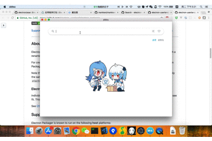

### 本项目基于原作者`ywwhack`的项目[`aidou-electron`](https://github.com/ywwhack/aidou-electron)

#### 主要修改
1. 调整单个表情包搜索源
2. 调整可执行程序Logo
3. 打包Windows端

在这个斗图的时代，没有几个表情怕是聊不了天了。为了防止「图穷」的尴尬处境，做了一个表情搜索 app

#### 用法
1. 根据关键字搜索表情
2. 鼠标点击表情一键复制到系统粘贴板
3. 微信/github/etc 都可直接粘贴使用

### 说明
1. 由于新的搜索源是自己的小鸡服务器（带宽贵啊,dog），可能出现响应慢
2. 表情包搜索源基于 sogou

#### 下载 & 安装
windows 版本 [下载](https://github.com/dy7338/doutu/releases)
`特别说明：windows版本不支持动态图片复制（系统特性）`

mac 版本 [下载](https://github.com/dy7338/doutu/releases)

chrome 插件版本 [aidou](https://github.com/kinglisky/aidou)

# **请我喝咖啡**

